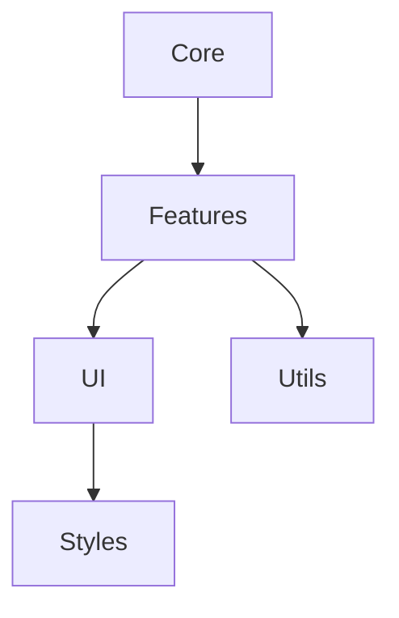

# Zoom Chat Parser Documentation

[English](DOCUMENTATION.md) | [Українська](lang/DOCUMENTATION.uk.md)

## Table of Contents

1. [Architecture](#architecture)
2. [Core Components](#core-components)
3. [Features](#features)
4. [API Reference](#api-reference)
5. [Security](#security)
6. [Performance](#performance)
7. [Troubleshooting](#troubleshooting)

## Architecture

The application is built with a modular architecture and clear separation of concerns:

### Directory Structure

```
src/
├── core/           # Core functionality
│   ├── config.js   # Configuration
│   ├── notification.js # Notification system
│   └── theme.js    # Theme management
├── features/       # Main features
│   ├── chat/      # Chat processing
│   ├── database/  # Database operations
│   └── export/    # Export functionality
├── ui/            # UI components
│   ├── components/ # Reusable components
│   └── views/     # Main view components
├── utils/         # Utilities
│   ├── file/      # File operations
│   ├── name/      # Name processing
│   └── validation/ # Input validation
└── styles/        # CSS styles
    ├── base/      # Base styles
    ├── components/ # Component styles
    └── themes/    # Theme styles
```

### Module Dependencies



## Core Components

### Configuration System

The configuration system (`config.js`) manages application settings:

```javascript
export const CONFIG = {
    MAX_FILE_SIZES: {
        CHAT: 5 * 1024 * 1024,    // 5MB
        DATABASE: 2 * 1024 * 1024  // 2MB
    },
    ALLOWED_FILE_TYPES: {
        CHAT: ['.txt'],
        DATABASE: ['.txt', '.csv', '.json']
    },
    // ... other settings
};
```

### Notification System

The notification system (`notification.js`) provides user feedback:

```javascript
export function showNotification(message, type = 'info') {
    // Implementation details
}
```

## Features

### Chat Processing

The chat processing module provides:

1. **Text Parsing**
   - Regular expressions for message extraction
   - Time and sender information parsing
   - Message content extraction

2. **Name Extraction**
   - Unique participant identification
   - Name normalization
   - Duplicate detection

### Database Operations

The database module provides:

1. **Import/Export**
   - File format validation
   - Data parsing and serialization
   - Error handling

2. **Name Matching**
   - Exact matching
   - Fuzzy matching
   - Transliteration support
   - Name variant handling

## API Reference

### File Operations

```javascript
/**
 * Import a file
 * @param {File} file - File to import
 * @param {Object} options - Import options
 * @returns {Promise<boolean>} Success status
 */
export async function importFile(file, options) {
    // Implementation
}

/**
 * Export data to file
 * @param {Object} data - Data to export
 * @param {string} format - Export format
 * @param {Object} options - Export options
 * @returns {boolean} Success status
 */
export function exportFile(data, format, options) {
    // Implementation
}
```

### Name Processing

```javascript
/**
 * Match name against database
 * @param {string} name - Name to match
 * @param {Array} database - Name database
 * @returns {Object} Match result
 */
export function matchName(name, database) {
    // Implementation
}
```

## Security

### File Validation

1. **Size Checks**
   - Maximum size limits
   - Progressive loading for large files

2. **Type Checks**
   - MIME type verification
   - Extension validation
   - Content verification

### Content Sanitization

1. **Input Processing**
   - HTML escaping
   - Special character handling
   - Script tag removal

2. **Output Encoding**
   - Proper character encoding
   - XSS prevention
   - Data sanitization

## Performance

### Optimization Techniques

1. **File Processing**
   - Chunked reading
   - Progressive parsing
   - Memory management

2. **Name Matching**
   - Indexed search
   - Result caching
   - Parallel processing

### Memory Management

1. **Resource Usage**
   - File size limits
   - Memory allocation
   - Garbage collection

2. **Performance Monitoring**
   - Execution time tracking
   - Memory usage monitoring
   - Error logging

## Troubleshooting

### Common Issues

1. **File Import Errors**
   - Size and format checks
   - Permission verification
   - Encoding verification

2. **Name Matching Issues**
   - Database format verification
   - Special character handling
   - Matching algorithm verification

### Debugging

1. **Console Logging**
   - Error tracking
   - Performance metrics
   - State monitoring

2. **Error Handling**
   - Graceful degradation
   - User feedback
   - Recovery procedures 