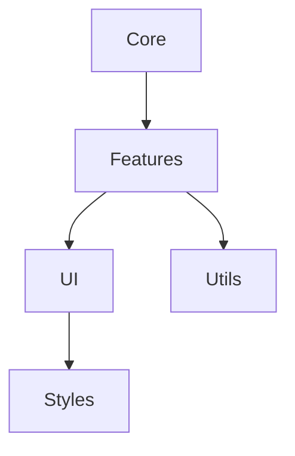

# Документація парсера чату Zoom

## Зміст

1. [Архітектура](#архітектура)
2. [Основні компоненти](#основні-компоненти)
3. [Функції](#функції)
4. [API Довідник](#api-довідник)
5. [Безпека](#безпека)
6. [Продуктивність](#продуктивність)
7. [Вирішення проблем](#вирішення-проблем)

## Архітектура

Додаток побудований за модульною архітектурою з чітким розділенням відповідальності:

### Структура директорій

```
src/
├── core/           # Базова функціональність
│   ├── config.js   # Налаштування
│   ├── notification.js # Система сповіщень
│   └── theme.js    # Управління темами
├── features/       # Основні функції
│   ├── chat/      # Обробка чату
│   ├── database/  # Операції з базою
│   └── export/    # Функціонал експорту
├── ui/            # Компоненти інтерфейсу
│   ├── components/ # Перевикористовувані компоненти
│   └── views/     # Основні компоненти відображення
├── utils/         # Утиліти
│   ├── file/      # Операції з файлами
│   ├── name/      # Обробка імен
│   └── validation/ # Валідація вводу
└── styles/        # CSS стилі
    ├── base/      # Базові стилі
    ├── components/ # Стилі компонентів
    └── themes/    # Стилі тем
```

### Залежності модулів



## Основні компоненти

### Система конфігурації

Система конфігурації (`config.js`) керує налаштуваннями додатку:

```javascript
export const CONFIG = {
    MAX_FILE_SIZES: {
        CHAT: 5 * 1024 * 1024,    // 5MB
        DATABASE: 2 * 1024 * 1024  // 2MB
    },
    ALLOWED_FILE_TYPES: {
        CHAT: ['.txt'],
        DATABASE: ['.txt', '.csv', '.json']
    },
    // ... інші налаштування
};
```

### Система сповіщень

Система сповіщень (`notification.js`) забезпечує зворотний зв'язок:

```javascript
export function showNotification(message, type = 'info') {
    // Деталі реалізації
}
```

## Функції

### Обробка чату

Модуль обробки чату забезпечує:

1. **Парсинг тексту**
   - Регулярні вирази для витягування повідомлень
   - Парсинг часу та інформації про відправника
   - Витягування вмісту повідомлення

2. **Витягування імен**
   - Ідентифікація унікальних учасників
   - Нормалізація імен
   - Виявлення дублікатів

### Операції з базою даних

Модуль бази даних надає:

1. **Імпорт/Експорт**
   - Валідація формату файлу
   - Парсинг та серіалізація даних
   - Обробка помилок

2. **Співставлення імен**
   - Точне співпадіння
   - Нечітке співпадіння
   - Підтримка транслітерації
   - Обробка варіантів імен

## API Довідник

### Операції з файлами

```javascript
/**
 * Імпорт файлу
 * @param {File} file - Файл для імпорту
 * @param {Object} options - Опції імпорту
 * @returns {Promise<boolean>} Статус успішності
 */
export async function importFile(file, options) {
    // Реалізація
}

/**
 * Експорт даних у файл
 * @param {Object} data - Дані для експорту
 * @param {string} format - Формат експорту
 * @param {Object} options - Опції експорту
 * @returns {boolean} Статус успішності
 */
export function exportFile(data, format, options) {
    // Реалізація
}
```

### Обробка імен

```javascript
/**
 * Співставлення імені з базою даних
 * @param {string} name - Ім'я для співставлення
 * @param {Array} database - База імен
 * @returns {Object} Результат співставлення
 */
export function matchName(name, database) {
    // Реалізація
}
```

## Безпека

### Валідація файлів

1. **Перевірка розміру**
   - Обмеження максимального розміру
   - Поступове завантаження великих файлів

2. **Перевірка типу**
   - Перевірка MIME-типу
   - Валідація розширення
   - Перевірка вмісту

### Санітизація контенту

1. **Обробка вводу**
   - Екранування HTML
   - Обробка спеціальних символів
   - Видалення тегів скриптів

2. **Кодування виводу**
   - Правильне кодування символів
   - Запобігання XSS
   - Санітизація даних

## Продуктивність

### Техніки оптимізації

1. **Обробка файлів**
   - Поблочне читання
   - Поступовий парсинг
   - Управління пам'яттю

2. **Співставлення імен**
   - Індексований пошук
   - Кешування результатів
   - Паралельна обробка

### Управління пам'яттю

1. **Використання ресурсів**
   - Обмеження розміру файлів
   - Розподіл пам'яті
   - Збірка сміття

2. **Моніторинг продуктивності**
   - Відстеження часу виконання
   - Моніторинг використання пам'яті
   - Логування помилок

## Вирішення проблем

### Поширені проблеми

1. **Помилки імпорту файлів**
   - Перевірка розміру та формату
   - Перевірка прав доступу
   - Перевірка кодування

2. **Проблеми співставлення імен**
   - Перевірка формату бази даних
   - Перевірка спеціальних символів
   - Перевірка алгоритму співставлення

### Налагодження

1. **Логування в консоль**
   - Відстеження помилок
   - Метрики продуктивності
   - Моніторинг стану

2. **Обробка помилок**
   - Плавне зниження функціональності
   - Зворотний зв'язок користувача
   - Процедури відновлення 